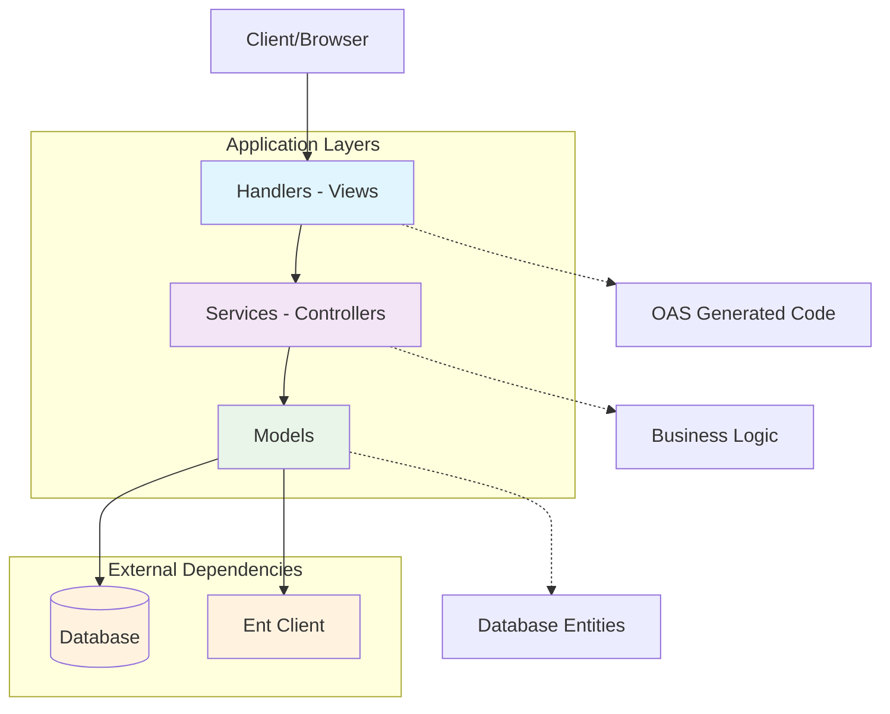

# example

Example project with best practices.

| Dependency type | Tool/Library                                      | Description                                    |
|-----------------|---------------------------------------------------|------------------------------------------------|
| Runtime         | [go-faster/sdk](https://github.com/go-faster/sdk) | Application SDK with logging, metrics, tracing |
| Error handling  | [go-faster/errors](github.com/go-faster/errors)   | Error wrapping and handling                    |
| ORM             | [ent](https://entgo.io/)                          | Entity framework for Go                        |
| Migrations      | [atlas](https://atlasgo.io/)                      | Database schema migrations and management      |
| Database        | [PostgreSQL](http://postgresql.org/) 18           | Reliable relational database                   |
| OpenAPI codegen | [ogen](https://ogen.dev/)                         | OpenAPI v3 code generator for Go               |
| OpenAPI linter  | [vacuum](https://quobix.com/vacuum/)              | OpenAPI v3 linter                              |
| Mocks           | [moq](https://github.com/matryer/moq)             | Generate mocks for Go interfaces               |

## Installation

### atlas

```bash
curl -sSf https://atlasgo.sh | sh
```

## Commits

[Conventional Commits](https://www.conventionalcommits.org/en/v1.0.0/) MUST be used.

## Structure

| File/Directory       | Description                                                                          |
|----------------------|--------------------------------------------------------------------------------------|
| `.github/`           | GitHub workflows and configurations                                                  |
| `_oas`               | OpenAPI specifications                                                               |
| `cmd/`               | Main applications                                                                    |
| `pkg/`               | Directory that **MUST NOT** exist                                                    |
| `internal/`          | Private application and library code. Most code **SHOULD** be here.                  |
| `.golangci.yml`      | GolangCI-Lint configuration                                                          |
| `.codecov.yml`       | Codecov configuration                                                                |
| `.editorconfig`      | Editor configuration                                                                 |
| `Dockerfile`         | Dockerfile for building the application                                              |
| `LICENSE`            | License file                                                                         |
| `Makefile`           | Makefile with common commands                                                        |
| `README.md`          | This file                                                                            |
| `generate.go`        | Code generation entrypoint                                                           |
| `go.coverage.sh`     | Script to generate coverage report                                                   |
| `go.mod`             | Go module definition. Tools are defined here.                                        |
| `go.sum`             | Go module checksums                                                                  |
| `go.test.sh`         | Script to run tests                                                                  |
| `migrate.Dockerfile` | Docker file for ent migrations                                                       |
| `AGENTS.md`          | Rules for LLMs. Linked to [copilot-instructions.md](.github/copilot-instructions.md) |
| .atlas.hcl           | Atlas configuration for ent migrations                                               |

### .github

#### Dependencies files

1. Dependabot configuration files with groups for otel and golang dependencies.
2. Dependency

#### Workflows

- Commit linting
- Dependency checks
- Linting
- Tests

##  _oas

OpenAPI specifications.

## generate.go

Code generation entrypoint.

## go.mod

Note that tools are defined here.
Example:

```
tool github.com/ogen-go/ogen/cmd/ogen
```

## internal

Most code SHOULD be here.

### ent

Ent ORM code.

Note `entc.go` and `generate.go` files.

#### atlas.hcl

Docker engine for atlas is configured as follows:

```hcl
data "external_schema" "ent" {
  program = [
    "go", "tool", "ent", "schema",
    "./internal/ent/schema",
    "--dialect", "postgres",
  ]
}

env "dev" {
  dev = "docker://postgres/18/test?search_path=public"
  src  = data.external_schema.ent.url
}
```

To add migration named `some-migration-name`:

```console
atlas migrate --env dev diff some-migration-name
```

#### schema

Ent schemas.

## cmd

Main application entrypoints.
All commands MUST be here.

### SDK

Applications SHOULD use [go-faster/sdk](https://github.com/go-faster/sdk).

## Approaches for structuring application

### MVC-like

Divide application into models, views (handlers), controllers (services).



Handlers are implementation of oas handlers. Call services.

Model abstracts database entities, i.e. ent client interactions.
Also model defines entities.

Service implements business logic, i.e. calls models and other services.

Pros
- Clear separation of concerns

Cons:
- More boilerplate code

### Direct

Just handlers with business logic and ent client usage.

Pros:
- Less boilerplate code

Cons:
- Harder to test
